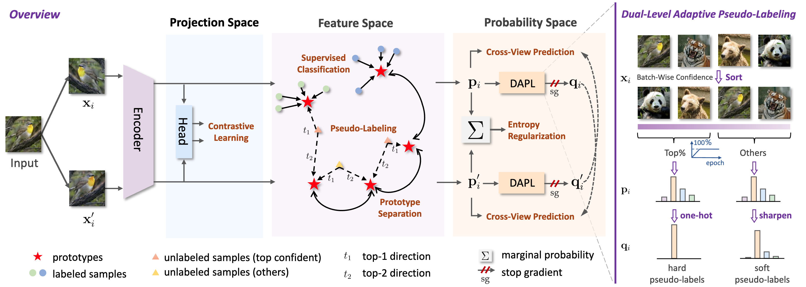

# ProtoGCD: Unified and Unbiased Prototype Learning for Generalized Category Discovery

<a href='https://ieeexplore.ieee.org/document/10948388'></a> <a href='https://arxiv.org/abs/2504.03755'></a> 

Official implementation of our TPAMI 2025 paper "ProtoGCD: Unified and Unbiased Prototype Learning for Generalized Category Discovery".



## :running: ​Running

### Dependencies

```
loguru
numpy
pandas
scikit_learn
scipy
torch==1.10.0
torchvision==0.11.1
tqdm
```

### Datasets

We conduct experiments on 7 datasets:

* Generic datasets: CIFAR-10, CIFAR-100, ImageNet-100
* Fine-grained datasets: [CUB](https://drive.google.com/drive/folders/1kFzIqZL_pEBVR7Ca_8IKibfWoeZc3GT1), [Stanford Cars](https://ai.stanford.edu/~jkrause/cars/car_dataset.html), [FGVC-Aircraft](https://www.robots.ox.ac.uk/~vgg/data/fgvc-aircraft/), [Herbarium19](https://www.kaggle.com/c/herbarium-2019-fgvc6)

### Config

Set paths to datasets in `config.py`

### Training ProtoGCD

CIFAR100:

```shell
CUDA_VISIBLE_DEVICES=0 python train_fix.py --dataset_name 'cifar100' --batch_size 128 --epochs 200 --num_workers 4 --use_ssb_splits --weight_decay 5e-5 --lr 0.1 --eval_funcs 'v2' --weight_sup 0.35 --weight_entropy_reg 2 --weight_proto_sep 0.1 --temp_logits 0.1 --temp_teacher_logits 0.05 --wait_ratio_epochs 0 --ramp_ratio_teacher_epochs 100 --init_ratio 0.0 --final_ratio 1.0 --exp_name cifar100_protogcd
```

CUB:

```shell
CUDA_VISIBLE_DEVICES=0 python train_fix.py --dataset_name 'cub' --batch_size 128 --epochs 200 --num_workers 2 --use_ssb_splits --weight_decay 5e-5 --lr 0.1 --eval_funcs 'v2' --weight_sup 0.35 --weight_entropy_reg 2 --weight_proto_sep 0.05 --temp_logits 0.1 --temp_teacher_logits 0.05 --wait_ratio_epochs 0 --ramp_ratio_teacher_epochs 100 --init_ratio 0.0 --final_ratio 1.0 --exp_name cub_protogcd
```

### Evaluate OOD detection

CIFAR:

```shell
CUDA_VISIBLE_DEVICES=0 python test_ood_cifar.py --dataset_name 'cifar100' --batch_size 128 --num_workers 4 --use_ssb_splits --num_to_avg 10 --score msp --ckpts_date YOUR_CKPTS_NAME --temp_logits 0.1
```

ImageNet:

```shell
CUDA_VISIBLE_DEVICES=0 python test_ood_imagenet.py --dataset_name 'imagenet_100' --batch_size 128 --num_workers 4 --use_ssb_splits --num_to_avg 10 --score msp --ckpts_date YOUR_CKPTS_NAME --temp_logits 0.1
```


## :clipboard: ​Citing this work

```bibtex
@ARTICLE{10948388,
  author={Ma, Shijie and Zhu, Fei and Zhang, Xu-Yao and Liu, Cheng-Lin},
  journal={IEEE Transactions on Pattern Analysis and Machine Intelligence}, 
  title={ProtoGCD: Unified and Unbiased Prototype Learning for Generalized Category Discovery}, 
  year={2025},
  volume={},
  number={},
  pages={1-17},
  keywords={Prototypes;Adaptation models;Contrastive learning;Training;Magnetic heads;Feature extraction;Estimation;Automobiles;Accuracy;Pragmatics;Generalized category discovery;open-world learning;prototype learning;semi-supervised learning},
  doi={10.1109/TPAMI.2025.3557502}
}
```


## :gift: ​Acknowledgements

In building the ProtoGCD codebase, we reference [SimGCD](https://github.com/CVMI-Lab/SimGCD).


## :white_check_mark: ​License

This project is licensed under the MIT License - see the [LICENSE](https://github.com/mashijie1028/ProtoGCD/blob/main/LICENSE) file for details.


## :email: ​Contact

If you have further questions or discussions, feel free to contact me:

Shijie Ma (mashijie2021@ia.ac.cn)